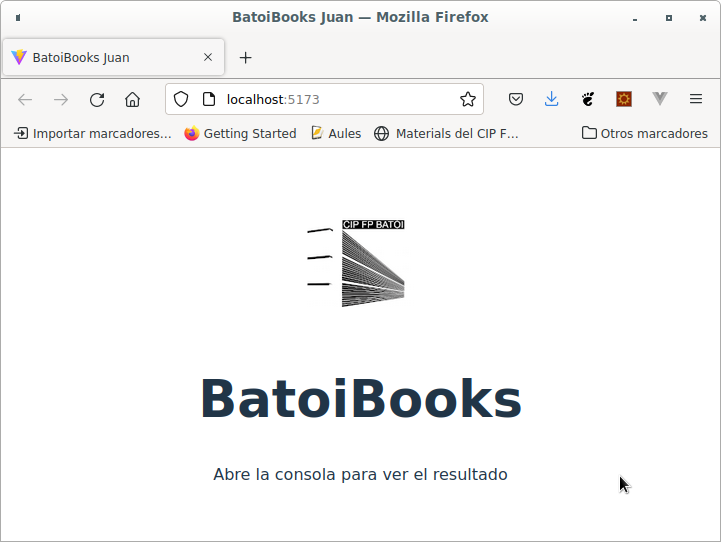
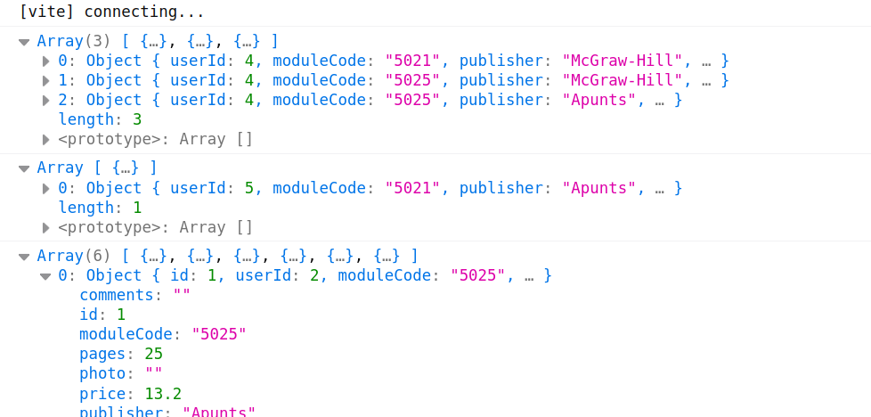

# BatoiBooks
- [BatoiBooks](#batoibooks)
  - [1 - Introducción](#1---introducción)
    - [Creación del proyecto](#creación-del-proyecto)
    - [Test](#test)
  - [PRÓXIMA PRÁCTICA: Arrays](#próxima-práctica-arrays)
    - [Tests](#tests)
    - [Restricciones de diseño](#restricciones-de-diseño)
    - [Auditoría](#auditoría)


## 1 - Introducción

Vamos a hacer una aplicación para vender libros de texto y apuntes entre los estudiantes del CIP FP Batoi. Las tablas con las que trabajaremos son:

- **courses**: son los distintos ciclos del centro. Sus campos son _id_ (autonumérico), _course_ (nombre corto del ciclo), _familyId_ (FK de la tabla families), _vliteral_ y _cliteral_ (nombre completo en valenciano y castellano).
- **families**: las familas profesionales del centro (informática, sanitaria, hostelería, ...). Sus campos son _id_ (autonumérico), _vliteral_ y _cliteral_ (nombre completo en valenciano y castellano).
- **modules**: los distintos módulos que se estudian en cada ciclo. Sus campos son _code_ (PK, cadena de 4 caracteres numéricos), _courseId_ (FK de la tabla courses), _vliteral_ y _cliteral_ (nombre completo en valenciano y castellano).
- **sales**: donde se registran las ventas producidas. Sus campos son _id_ (autonumérico), _bookId_ (FK de la tabla books), _userId_ (FK de la tabla users), _date_ (data de venta en format AAAA-MM-DD) y _status_ (estado de la venta, numérico).
- **users**: datos de los usuarios registrados en la aplicación. Sus campos son _id_ (autonumérico), _nick_, _email_ y _password_.
- **books**: libros y apuntes en venta. Sus campos son:
  - _id_ (autonumérico)
  - _userId_: FK de la tabla users
  - _moduleCode_: FK de la tabla modules
  - _publisher_: editorial que publica el libro. Si son apuntes su valor es "Apunts"
  - _price_: precio (numérico)
  - _pages_: páginas del libro/apuntes (numérico)
  - _status_: estado del libro que puede tomar uno de los valores "new", "good", "used", "bad". Si es un libro/apuntes digital su valor será "digital"
  - _photo_: ruta a la foto
  - _comments_: comentarios
  - _soldDate_: fecha de venta del libro, en formato YYYY-MM-DD. Si aún no está vendido este campo estará en blanco

### Creación del proyecto
Este proyecto lo iremos desarrollando a lo largo de la primera evaluación y también lo trabajaréis en el módulo de **DAW** (para desplegarlo) y **DWES** (para hacer la autenticación y las ventas, pero se hará al final).
 
De momento los datos con los que trabaja la aplicación los tenemos en el fichero `datos.js` en una variable llamada **data**. Más adelante haremos peticiones a una API ficticia que montaremos con json-server y por último lo integraremos con una API que haréis en DWES para dejar la aplicación acabada.
 
En esta aplicación tendremos muchos ficheros diferentes (para empezar `datos.js` y luego añadiremos muchos más) así que crearemos un nuevo proyecto usando _Vite_. Para cada práctica incluida en el proyecto crearemos una nueva rama en git y la entrega será el enlace a la rama de dicha práctica de vuestro repositorio.
 
Al crear el proyecto con Vite indicaremos que vamos a usar sólo Javascript (Vanilla). Le podéis llamar BatoiBooks. Una vez generado el proyecto y arrancado el servidor de desarrollo cambiaremos el código para adaptarlo a nuestro proyecto como hicimos con el _ejercicio 1.3-fraseVite_:

- en la carpeta raíz del proyecto creamos una carpeta `test/` para los test
- eliminamos los ficheros de los logos que hay en `src/assets/` (`.svg` y `.png`)
- copiamos a `src/assets/` nuestro logo (`logoBatoi.png`)
- eliminamos el fichero `counter.js`
- creamos dentro de `src/` un fichero `functions.js` para incluir y exportar las funciones. Por ahora como no hay funciones su contenido será sólo `export { }` para que no de error al importar
- creamos una carpeta `src/services` y copiamos allí el fichero `datos.js`
- modificamos `main.js` para que:
  - importe sólo el `style.css`, nuestro logo y nuestro fichero `functions.js`
  - renderice sólo un DIV que contenga nuestro logo, debajo el título _BatoiBooks_ y debajo un párrafo con el testo "Abre la consola para ver el resultado"

En el `index.html` cambiaremos el título a _**BatoiBooks miNombre**_ (ej. _BatoiBooks Juan_). El resultado será algo como:


 
### Test
Para testear nuestra aplicación usaremos **Vitest** (recordad instalarlo como dependencia de desarrollo). Los test los tenéis en el fichero `main.test.js` que debéis copiar a una carpeta llamada `test/` dentro de nuestro proyecto.

## PRÓXIMA PRÁCTICA: Arrays

Esta primera parte de la aplicación la desarrollaremos en la rama '**2-arrays**'. Aquí crearemos las principales funciones para trabajar con nuestros datos (recuerda que por ahora los tenemos en el fichero `datos.js` en una variable llamada _data_). En esta práctica haremos las funciones para trabajar con libros, usuarios y módulos.

Recuerda que tenemos el código en ficheros JS distintos:

- `src/main.js`: es el módulo principal que importa los demás, renderiza la página y hace llamadas a las funciones y muestra datos por la consola
- `src/functions.js`: es el fichero donde crearemos las funciones que consultan y transforman esos datos. Necesitaremos crear funciones para:
  - Dada la id de un libro, ¿cuáles son sus datos?
  - ¿Y su posición en el array?
  - ¿Ya tiene un usuario un libro puesto a la venta de un módulo concreto? (Esto evita que alguien duplique anuncios)
  - ¿Qué libros ha puesto a la venta un usuario?
  - ¿Y un módulo concreto?
  - ¿Qué libros cuestan igual o menos que un precio dado?
  - ¿Qué libros están en un estado concreto ("new", "good"...)?
  - ¿Cuál es el precio medio de los libros, con 2 decimales y el símbolo €?
  - ¿Qué libros son apuntes en lugar de libros de editorial?
  - ¿Qué libros no se han vendido todavía?
  - Si subimos todos los precios un porcentaje, ¿cuál sería el nuevo array de libros?
  - Funciones equivalentes a buscar un libro pero para buscar un usuario (por id, por posición, por nick) y un módulo (por código)

Deberás realizar por tanto al menos 14 funciones, que deben llamarse exactamente: `getBookById`, `getBookIndexById`, `getUserById`, `getUserIndexById`, `getUserByNickName`, `getModuleByCode`, `booksFromUser`, `booksFromModule`, `booksCheeperThan`, `booksWithStatus`, `booksOfTypeNotes`, `bookExists`, `booksNotSold`, `incrementPriceOfbooks`. Si no coinciden los nombres, aunque la función haga lo mismo, no contará como resuelta para la corrección.

Por ejemplo la primera función se llama _**getBookById**_. Recibiría como parámetros el array de libros y una id y devolvería el libro buscado:

```typescript
getBookById(books: array, bookId: number) : object
```

NOTA: ¿Qué debería hacer esta función si no existe un libro con la _id_ que nos han pasado?

En el `main.js` pondremos el código para:

- importar el fichero con las funciones
- importar el fichero con los datos
- mostrar por consola:
  - todos los libros del usuario 4
  - todos los libros del módulo 5021 que están en buen estado ("good")
- incrementar un 10% el precio de los libros y mostrarlos por consola con el nuevo precio

El resultado debe ser algo como:



### Tests
Antes de escribir cada función deberíamos escribir los tests que debe pasar la misma: la idea es que el test sea tu forma de decidir qué debe pasar, no una confirmación a posteriori. Puedes hacerlo con ayuda de la IA. Por ejemplo creamos el fichero `functions.test.js` dentro de la carpeta de test donde programamos los tests, que para esta función en concreto podría ser:

```javascript
import { describe, it, expect } from 'vitest'
import * as functions from '../src/functions'
import data from '../src/services/datos'

const books = data.books
const users = data.users
const modules = data.modules

describe('function getBookById', () => {
 it('getBookById 1 devuelve el libro con id 1', () => {
   const response = functions.getBookById(books, 1)
   expect(response.id).toBe(1)
 });

 it('getBookById 22 devuelve un error', () => {
   expect(() => functions.getBookById(books, 22)).toThrow()
 });
})
```

Partiendo de este test añade un _describe_ para cada una de tus funciones donde pongas los tests que debería pasar la función. Ve ejecutando `npm run test` antes de escribir el código de cada función (para ver que no pasa el test) y una vez escrito el código (para ver que lo pasa).

### Restricciones de diseño

- No puedes usar ningún bucle _for_ ni _while_. Todo debe resolverse con programación funcional (_map_, _filter_, _reduce_, _find_...). No es un capricho: en código que trabaja con colecciones, las funciones de array son más declarativas, más fáciles de encadenar y más fáciles de leer para otra persona —o para una IA— que un bucle imperativo.
- Ninguna función debe modificar el array original. Si necesitas transformar datos (como al subir los precios), devuelve un array nuevo. 
- Nunca hay que _hardcodear_ nada!!!.

### Auditoría

En la raíz del proyecto crea un fichero llamado `AUDITORIA.md` donde expliques por qué estaría mal la siguiente función y escríbela correctamente:

```javascript
function booksNotSold(books) {
  let result = []
  for (let book of books) {
    if (book.soldDate == null) {
      result.push(book)
    }
  }
 return result
}
```

Escribe también en ese fichero una variante de la función `incrementPriceOfbooks` que cambie el array original en vez de devolver un array nuevo. Explica por qué es mejor la primera versión.

RECUERDA: seguir haciendo todas las buenas prácticas que se indicaban en el ejercicio anterior.

